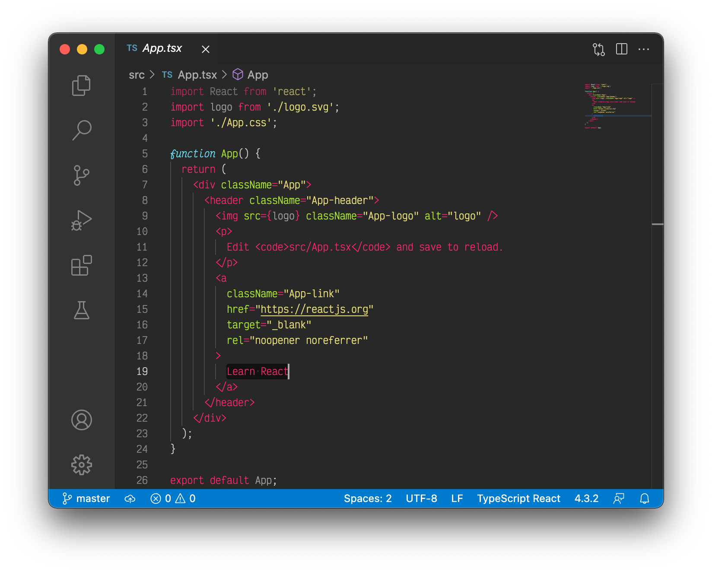
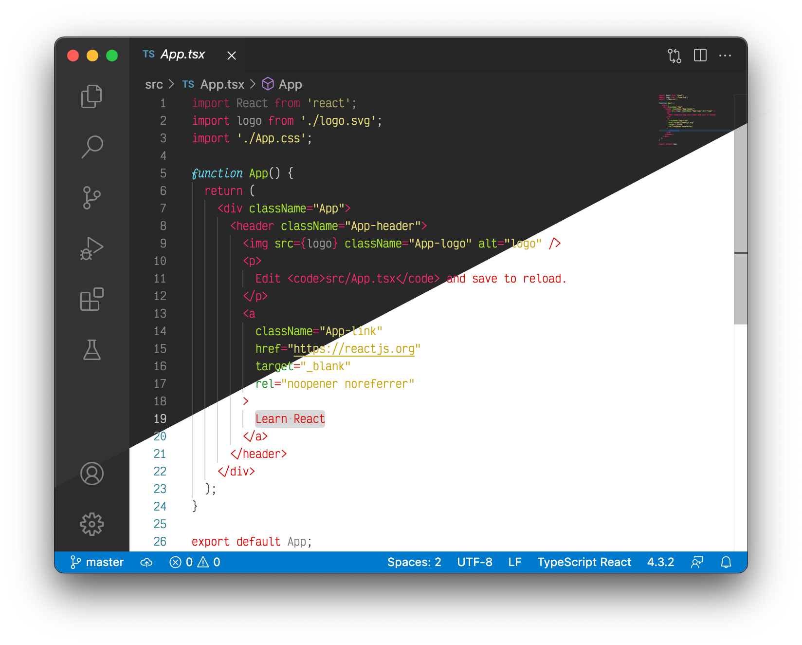

# Monokai Dark theme for VS Code
This theme has a dark background with light text and uses the colors of the original Monokai theme.

This theme is designed to accompany the [monokai-light](https://github.com/moritzmhmk/vscode-monokai-light) theme when used with automatic dark-/lightmode switching.

This is based on [babsveloso](https://github.com/babsveloso/atom-monokai-light)'s mod of the original Monokai port by [kevinsawicki](https://github.com/kevinsawicki/monokai).